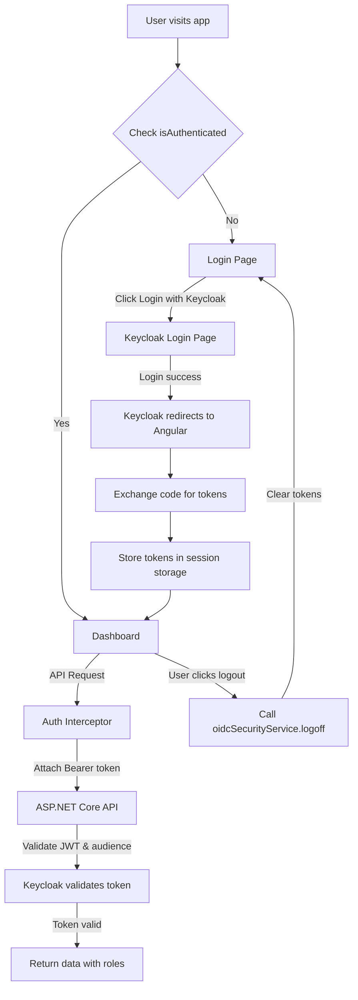

# CAAdventureWorks

A production-ready ASP.NET Core Web API built on **Clean Architecture**, featuring the full **AdventureWorks** database schema, **Microsoft Aspire** orchestration, **Keycloak** authentication, and an **Angular 21** admin dashboard.

This project was generated using the [Clean.Architecture.Solution.Template](https://github.com/jasontaylordev/CleanArchitecture) version **10.8.0**.

## Table of Contents

- [Overview](#overview)
- [Architecture](#architecture)
- [Tech Stack](#tech-stack)
- [Project Structure](#project-structure)
- [Prerequisites](#prerequisites)
- [Getting Started](#getting-started)
- [Keycloak Authentication](#keycloak-authentication)
  - [Realm & Clients](#realm--clients)
  - [Roles](#roles)
  - [Admin Access](#admin-access)
  - [Frontend Authentication Flow](#frontend-authentication-flow)
- [Angular Frontend Authentication](#angular-frontend-authentication)
  - [Authentication Flow](#authentication-flow)
  - [Auth Service & Guards](#auth-service--guards)
  - [Environment Configuration](#environment-configuration)
  - [HTTP Interceptor](#http-interceptor)
- [Authorization Policies](#authorization-policies)
- [API Endpoints](#api-endpoints)
- [Database Schema](#database-schema)
- [MediatR Pipeline Behaviors](#mediatr-pipeline-behaviors)
- [Code Scaffolding](#code-scaffolding)
- [Code Styles](#code-styles)
- [Testing](#testing)
- [Dev Container](#dev-container)
- [Troubleshooting](#troubleshooting)

## Overview

CAAdventureWorks is an enterprise-grade REST API that exposes the **AdventureWorks** (OLTP) database through a clean, well-structured API. The project demonstrates modern .NET development patterns including CQRS, domain-driven design, and cloud-ready infrastructure via Microsoft Aspire.

## Architecture

The solution follows the **Clean Architecture** pattern with four main layers:

```
src/
├── Domain/           # Entities, value objects, domain events, enums
├── Application/       # Use cases, commands, queries, MediatR handlers, DTOs
├── Infrastructure/   # EF Core, authentication, external services
└── Web/              # API endpoints, middleware, configuration
```

Plus orchestration and shared concerns:

```
├── AppHost/           # Microsoft Aspire application host
├── ServiceDefaults/   # OpenTelemetry, resilience, service discovery defaults
├── Shared/           # Shared models and utilities
└── WebFrontend/      # Angular 21 admin dashboard (CoreUI)
```

### Clean Architecture Layers

| Layer | Responsibility |
|-------|----------------|
| **Domain** | Business entities, rules, and events. No external dependencies. |
| **Application** | Use cases (CQRS via MediatR), DTOs, validators, authorization behaviors. |
| **Infrastructure** | EF Core DbContext, repositories, Keycloak/JWT auth, interceptors. |
| **Web** | Minimal API endpoints, OpenAPI (Scalar), CORS, middleware. |
| **AppHost** | Aspire orchestration: Keycloak container, Web API, service discovery. |
| **ServiceDefaults** | Cross-cutting concerns: telemetry, resilience, health checks. |

## Tech Stack

| Component | Technology | Version |
|-----------|------------|---------|
| Runtime | .NET | 10.0.201 |
| Web Framework | ASP.NET Core | 10 |
| ORM | Entity Framework Core | 10 |
| Database | SQL Server (LocalDB) | - |
| Authentication | Keycloak + JWT Bearer | 26.6.1 |
| Messaging | MediatR | Latest |
| Validation | FluentValidation | Latest |
| API Docs | Scalar (OpenAPI UI) | - |
| Orchestration | Microsoft Aspire | Latest |
| Observability | OpenTelemetry | Latest |
| Frontend | Angular 21 + CoreUI | 5.6.21 |

## Project Structure

```
CAAdventureWorks/
├── src/
│   ├── AppHost/                  # Aspire App Host
│   │   ├── Program.cs            # Orchestration entry point
│   │   └── keycloak/
│   │       └── realm-export.json # Keycloak realm configuration
│   ├── Application/             # Application layer
│   │   ├── Common/
│   │   │   ├── Behaviors/        # MediatR pipeline behaviors
│   │   │   │   ├── AuthorizationBehaviour.cs
│   │   │   │   ├── LoggingBehaviour.cs
│   │   │   │   ├── PerformanceBehaviour.cs
│   │   │   │   └── ValidationBehaviour.cs
│   │   │   ├── Exceptions/       # Custom exceptions
│   │   │   └── Interfaces/       # Service interfaces
│   │   ├── Departments/          # Example feature module
│   │   │   ├── Commands/         # Create, Update, Delete
│   │   │   └── Queries/          # Get all, Get by ID
│   │   └── WeatherForecasts/     # Sample module
│   ├── Domain/                   # Domain layer (98 entities)
│   │   ├── Entities/             # Entity classes
│   │   ├── Enums/                # Enumerations
│   │   └── Exceptions/           # Domain exceptions
│   ├── Infrastructure/           # Infrastructure layer
│   │   ├── Data/
│   │   │   ├── ApplicationDbContext.cs
│   │   │   ├── ApplicationDbContextInitialiser.cs
│   │   │   └── Interceptors/
│   │   │       ├── AuditableEntityInterceptor.cs
│   │   │       └── DispatchDomainEventsInterceptor.cs
│   │   └── Identity/
│   │       └── IdentityService.cs
│   ├── ServiceDefaults/          # Aspire service defaults
│   ├── Shared/                   # Shared utilities
│   ├── Web/                      # Web layer
│   │   ├── Program.cs            # Web API entry point
│   │   ├── Endpoints/            # Minimal API endpoint groups
│   │   └── Services/             # Web-scoped services
│   └── WebFrontend/              # Angular 21 admin dashboard (CoreUI)
├── tests/                        # Test projects
│   ├── Application.FunctionalTests/
│   ├── Application.UnitTests/
│   ├── Domain.UnitTests/
│   ├── Infrastructure.IntegrationTests/
│   └── TestAppHost/
├── .aspire/                      # Aspire settings
│   └── settings.json
├── .devcontainer/                # Dev container config
├── .editorconfig                 # Code style settings
└── global.json                   # SDK version
```

## Prerequisites

- [.NET 10 SDK](https://dotnet.microsoft.com/download/dotnet/10.0) (version 10.0.201)
- [SQL Server LocalDB](https://learn.microsoft.com/en-us/sql/database-engine/configure-windows/sql-server-express-localdb) or SQL Server
- [Docker Desktop](https://www.docker.com/products/docker-desktop/) (for Aspire orchestration)
- [Visual Studio 2022](https://visualstudio.microsoft.com/vs/) or [VS Code](https://code.visualstudio.com/) with C# extension
- [.NET 10 SDK](https://dotnet.microsoft.com/download/dotnet/10.0)
- [Node.js 20+](https://nodejs.org/) (for Angular frontend)

## Getting Started

### 1. Clone and Build

```bash
cd CAAdventureWorks
dotnet build
```

### 2. Configure Database

Ensure SQL Server LocalDB is running:

```bash
# Check LocalDB instances
sqllocaldb info
```

Update `appsettings.Development.json` if your connection string differs:

```json
{
  "ConnectionStrings": {
    "AdventureWorks": "Server=(localdb)\\MSSQLLocalDB;Database=AdventureWorks;Trusted_Connection=True;TrustServerCertificate=True;MultipleActiveResultSets=true"
  }
}
```

### 3. Run with Aspire

```bash
dotnet run --project src/AppHost
```

The Aspire dashboard will open automatically, showing:
- **Web API** endpoint
- **Angular Frontend** at port 4200
- **Scalar API Reference** at `/scalar`
- **Keycloak** admin console at `http://localhost:8080`
- Health checks and telemetry

### 4. Run Without Aspire

To run just the Web API directly:

```bash
cd src/Web
dotnet run
```

The API will be available at `https://localhost:5001` (or `http://localhost:5000` in Development).

## Keycloak Authentication

Keycloak is used for identity and access management with JWT Bearer token authentication.

### Realm & Clients

| Client ID | Protocol | Purpose |
|-----------|----------|---------|
| `adventureworks-api` | openid-connect | API authentication (resource server) |
| `adventureworks-web` | openid-connect | Angular SPA (public client, PKCE) |

Both clients belong to the **AdventureWorks** realm (version 26.6.1) and share the same realm roles.

### Roles

| Role | Description |
|------|-------------|
| Executive | Full access |
| HumanResources | HR department access |
| Finance | Finance department access |
| Information-Services | IT department access |
| Production | Manufacturing production access |
| Production-Control | Production control access |
| Sales | Sales department access |
| Marketing | Marketing department access |
| Purchasing | Purchasing/inventory access |
| Quality-Assurance | QA department access |
| Document-Control | Document management access |
| Engineering | R&D engineering access |
| Tool-Design | Tool design access |
| Shipping-and-Receiving | Logistics access |
| Facilities-And-Maintenance | Facilities access |

### Admin Access

| | URL |
|---|---|
| Keycloak | http://localhost:8080 |
| Admin Console | http://localhost:8080/admin/ |
| Default credentials | `admin` / `admin123` |

### Frontend Authentication Flow

The Angular SPA uses the **Authorization Code Flow with PKCE** (no client secret):

1. User visits `http://localhost:4200`
2. `authGuard` checks `isAuthenticated$` — redirects to `/login` if not authenticated
3. User clicks **Login with Keycloak**
4. Redirects to Keycloak login page
5. After login, Keycloak redirects back to Angular with an authorization code
6. `angular-auth-oidc-client` exchanges the code for tokens (access token, ID token, refresh token)
7. Access token is attached to API requests via `authInterceptor`
8. Header dropdown shows user name, email, and roles



> **Note:** If the API returns 401/403, ensure the JWT token includes `adventureworks-api` in its `aud` (audience) claim. This requires an **Audience mapper** on the `adventureworks-web` client in Keycloak. See [Troubleshooting](#token-validation-errors) for details.

### Getting an Access Token (Backend-to-Backend)

For backend services or direct API testing:

```bash
curl -X POST "http://localhost:8080/realms/AdventureWorks/protocol/openid-connect/token" \
  -H "Content-Type: application/x-www-form-urlencoded" \
  -d "grant_type=password" \
  -d "client_id=adventureworks-api" \
  -d "client_secret=<client-secret>" \
  -d "username=<username>" \
  -d "password=<password>"
```

## Angular Frontend Authentication

The Angular 21 SPA integrates with Keycloak using `angular-auth-oidc-client`.

### Authentication Flow

The frontend uses the **Authorization Code Flow with PKCE** (public client, no client secret). The `angular-auth-oidc-client` library handles token storage, silent renew, and refresh.

### Auth Service & Guards

| File | Purpose |
|------|---------|
| `core/services/auth.service.ts` | Wrapper around `OidcSecurityService` — `login()`, `logout()`, `isAuthenticated$`, `userData$`, `accessToken$`, `getRoles()` |
| `core/guards/auth.guard.ts` | Protects routes — redirects to `/login` if not authenticated |
| `core/guards/role.guard.ts` | Role-based access — redirects to `/dashboard` if user lacks required roles |

```typescript
// Protecting a route with authGuard
{ path: '', loadComponent: () => import('./layout').then(m => m.DefaultLayoutComponent),
  canActivate: [authGuard], ... }

// Protecting a route with roleGuard
{ path: 'admin', canActivate: [roleGuard(['Executive'])], ... }
```

### Environment Configuration

```typescript
// environment.ts (development)
export const environment = {
  production: false,
  keycloak: {
    authority: 'http://localhost:8080/realms/AdventureWorks',
    clientId: 'adventureworks-web',
    redirectUri: 'http://localhost:4200',
    postLogoutRedirectUri: 'http://localhost:4200',
    scope: 'openid profile email roles',
    responseType: 'code',
    silentRenew: true,
    useRefreshToken: true,
    showDebugInformation: true,
  },
  apiUrl: 'http://localhost:5000',
};
```

### HTTP Interceptor

The `authInterceptor` automatically attaches the Bearer token to every HTTP request:

```typescript
// core/interceptors/auth.interceptor.ts
export const authInterceptor: HttpInterceptorFn = (req, next) => {
  const authService = inject(AuthService);
  return authService.accessToken$.pipe(
    first((token) => token !== null && token !== undefined),
    switchMap((token) => {
      const authReq = req.clone({
        setHeaders: { Authorization: `Bearer ${token}` },
      });
      return next(authReq);
    })
  );
};
```

### DefaultHeader Integration

The header component displays the authenticated user's name, email, and roles from the Keycloak ID token. The logout button clears tokens and redirects to the login page.

## Authorization Policies

The application defines role-based authorization policies in `Infrastructure/DependencyInjection.cs`:

| Policy | Required Role(s) |
|--------|------------------|
| `Executive-General-And-Administration-Manager` | Executive, Information-Services, Finance, HumanResources, Facilities-And-Maintenance |
| `Executive` | Executive |
| `Information-Services` | Information-Services |
| `Finance` | Finance |
| `Human-Resources` | HumanResources |
| `Facilities-And-Maintenance` | Facilities-And-Maintenance |
| `Quality-Assurance-Manager` | Document-Control, Quality-Assurance |
| `Document-Control` | Document-Control |
| `Quality-Assurance` | Quality-Assurance |
| `Research-and-Development` | Engineering, Tool-Design |
| `Engineering` | Engineering |
| `Tool-Design` | Tool-Design |
| `Manufacturing` | Production, Production-Control |
| `Production` | Production |
| `Sales-and-Marketing` | Sales, Marketing |
| `Sales` | Sales |
| `Marketing` | Marketing |
| `Inventory-Management` | Purchasing |
| `Shipping-and-Receiving` | Shipping-and-Receiving |

### Using Authorization in MediatR Handlers

Apply the `[Authorize]` attribute to request classes:

```csharp
[Authorize(Roles = "Executive,Finance")]
public class GetExecutiveReportQuery : IRequest<ReportDto>
{
    // ...
}
```

Or use policy-based authorization:

```csharp
[Authorize(Policy = "Executive")]
public class GetExecutiveDataQuery : IRequest<DataDto>
{
    // ...
}
```

## API Endpoints

### Departments

| Method | Endpoint | Description | Authorization |
|--------|----------|-------------|---------------|
| GET | `/departments` | List all departments | Public |
| GET | `/departments/{id}` | Get department by ID | Administrator |
| POST | `/departments` | Create a department | Administrator |
| PUT | `/departments/{id}` | Update a department | Administrator |
| DELETE | `/departments/{id}` | Delete a department | Administrator |

### System

| Method | Endpoint | Description |
|--------|----------|-------------|
| GET | `/` | Redirects to Scalar API Reference |
| GET | `/scalar` | OpenAPI reference UI |
| GET | `/health` | Health check endpoint |

### API Documentation

Access the **Scalar** API reference at `http://localhost:5000/scalar` (or `/scalar` via Aspire) for an interactive API explorer.

## Database Schema

The `ApplicationDbContext` maps 75+ DbSets from the AdventureWorks database across these domains:

- **Human Resources**: Employee, Department, Shift, EmployeeDepartmentHistory
- **Person**: Contact, Address, Customer
- **Production**: Product, ProductCategory, ProductModel, WorkOrder
- **Purchasing**: Vendor, PurchaseOrderHeader, ProductVendor
- **Sales**: SalesOrderHeader, SalesOrderDetail, Customer, Store
- **Special Offers**: SpecialOffer, SpecialOfferProduct
- **Documentation**: Document, Illustration
- **Workforce**: JobCandidate, EmployeePayHistory

### Audit Fields

All entities inherit audit fields managed by the `AuditableEntityInterceptor`:
- `ModifiedDate` - Automatically updated on every save

### Domain Events

The `DispatchDomainEventsInterceptor` automatically dispatches domain events after successful saves.

## MediatR Pipeline Behaviors

The request pipeline is configured with four behaviors that execute in order:

1. **LoggingBehaviour** - Logs all incoming requests and outcomes
2. **AuthorizationBehaviour** - Validates roles and policies
3. **ValidationBehaviour** - Runs FluentValidation validators
4. **PerformanceBehaviour** - Logs requests exceeding the threshold (500ms)

## Code Scaffolding

The template supports scaffolding new commands and queries using the `ca-usecase` template.

### Create a Command

```bash
dotnet new ca-usecase --name CreateProduct --feature-name Products --usecase-type command --return-type int
```

### Create a Query

```bash
dotnet new ca-usecase -n GetProducts -fn Products -ut query -rt ProductDtos
```

### Available Options

| Option | Flag | Description |
|--------|------|-------------|
| `--name` | `-n` | Name of the use case |
| `--feature-name` | `-fn` | Feature folder name |
| `--usecase-type` | `-ut` | `command` or `query` |
| `--return-type` | `-rt` | Return type (e.g., `int`, `ProductDto`) |

If you encounter the error *"No templates or subcommands found matching: 'ca-usecase'"*, install the template:

```bash
dotnet new install Clean.Architecture.Solution.Template::10.8.0
```

## Code Styles

The project uses [EditorConfig](https://editorconfig.org/) (`.editorconfig`) to enforce consistent coding styles:

- **Indentation**: 4 spaces for C#, 2 spaces for JSON/XML
- **Line endings**: LF
- **Naming conventions**:
  - PascalCase for types, methods, properties, events
  - `I` prefix for interfaces
  - `T` prefix for generic type parameters
  - camelCase for local variables and parameters
  - `_camelCase` for private fields

## Testing

The solution includes multiple test projects:

| Project | Type | Purpose |
|---------|------|---------|
| `Domain.UnitTests` | Unit | Domain logic |
| `Application.UnitTests` | Unit | Use cases, validators |
| `Infrastructure.IntegrationTests` | Integration | Database operations |
| `Application.FunctionalTests` | Functional | API endpoint testing |

### Run All Tests

```bash
dotnet test
```

### Run Specific Test Project

```bash
dotnet test tests/Domain.UnitTests
```

## Dev Container

The project includes a Dev Container configuration for Docker-in-Docker development:

- **Base Image**: `mcr.microsoft.com/devcontainers/python:3.13-bullseye`
- **Memory**: 8GB minimum
- **Extensions**: GitHub Actions, Docker

### Opening in Dev Container

1. Install the **Dev Containers** extension in VS Code
2. Open the Command Palette (`Ctrl+Shift+P`)
3. Select **Dev Containers: Open Folder in Container...**
4. Select the project folder

## Troubleshooting

### Keycloak Container Not Starting

```bash
# Check Docker is running
docker info

# Check container logs
docker logs keycloak
```

### Database Connection Issues

```bash
# List LocalDB instances
sqllocaldb info

# Delete and recreate the database
sqllocaldb stop MSSQLLocalDB
sqllocaldb delete MSSQLLocalDB
sqllocaldb create MSSQLLocalDB
```

### Token Validation Errors

If the API returns **401 Unauthorized** after successful login, the JWT token's audience (`aud`) claim may not include `adventureworks-api`. Tokens issued to the `adventureworks-web` client default to audience `adventureworks-web` only.

**Solution — add an Audience mapper to the `adventureworks-web` client in Keycloak:**

1. Go to **Clients** → **adventureworks-web** → **Client scopes**
2. Click **adventureworks-web-dedicated**
3. Click **Add mapper** → **By configuration** → **Audience**
4. Configure:
   - **Name**: `audience-for-api`
   - **Included Client Audience**: `adventureworks-api`
   - **Add to ID token**: `OFF`
   - **Add to access token**: `ON`
5. Click **Save**
6. **Logout and login again** to get a new token

After this, the token's `aud` claim will contain both `adventureworks-web` and `adventureworks-api`.

**Alternative — update `appsettings.Development.json` to accept the web client as audience:**

```json
{
  "Keycloak": {
    "Audience": "adventureworks-web"
  }
}
```

### Aspire Dashboard Not Opening

Run the AppHost with the `--no-launch-profile` flag to manually open the dashboard:

```bash
dotnet run --project src/AppHost --no-launch-profile
```

## License

This project is generated from the [Clean.Architecture.Solution.Template](https://github.com/jasontaylordev/CleanArchitecture).

## Resources

- [Clean Architecture Template](https://cleanarchitecture.jasontaylor.dev)
- [.NET Documentation](https://learn.microsoft.com/en-us/dotnet/)
- [Microsoft Aspire](https://learn.microsoft.com/en-us/dotnet/aspire/)
- [Entity Framework Core](https://learn.microsoft.com/en-us/ef/core/)
- [Keycloak Documentation](https://www.keycloak.org/documentation)
